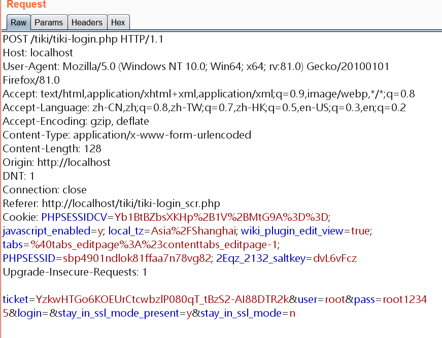

Tiki Wiki是基于PHP、ADOdb以及smarty开发的CMS，是一个基于LGPL协议的开源工程，由来自全世界范围的的开源爱好者、捐赠者参与开发维护。通过Tiki Wiki 可以很轻松的搭建各种类型的站点、门户、内部网等

Tiki Wiki同样也是一个强大的基于Web的协作工具，内置了很多功能选项，当需要某个功能时可以很方便的将该功能激活，更多内容访问[tiki wiki官网](https://tiki.org/)，目前最新版本21.2

## 漏洞危害：High

在 16.x - 21.1 版本中，通过该漏洞可以允许未经身份验证的远程攻击者绕过登录页面，从而完全破坏了Tiki Wiki CMS

攻击者通过暴力破解管理员帐户，直到被锁定为止。之后，可以使用一个空的密码以*admin*身份进行身份验证以获取访问权限

## 影响范围

Tiki Wiki Cms Groupware 16.x - 21.1

## 受影响的文件

- `tiki-login.php`

## 环境配置

采用 [phpstudy_pro](https://www.xp.cn/) 集成环境进行漏洞测试，其中测试版本如下：

- Apache2.4
- Mysql8.0
- PHP7.2

下载测试目标版本：[tiki-21.1](https://jztkft.dl.sourceforge.net/project/tikiwiki/Tiki_21.x_UY_Scuti/21.1/tiki-21.1.zip)

## 漏洞复现

导航到`tiki-login.php`登录页面，输入用户名和密码，并通过BP代理拦截请求包

将该请求发送到 Intruder，并且进行密码爆破，

[安全更新](https://info.tiki.org/article473-Security-Releases-of-all-Tiki-versions-since-16-3)

## 总结

## Ref.

- [tiki_doc](http://doc.tiki.org/Documentation)
- [github_S1lkys](https://github.com/S1lkys/CVE-2020-15906)
- [CNNVD](http://www.cnnvd.org.cn/web/xxk/ldxqById.tag?CNNVD=CNNVD-202010-1203)

